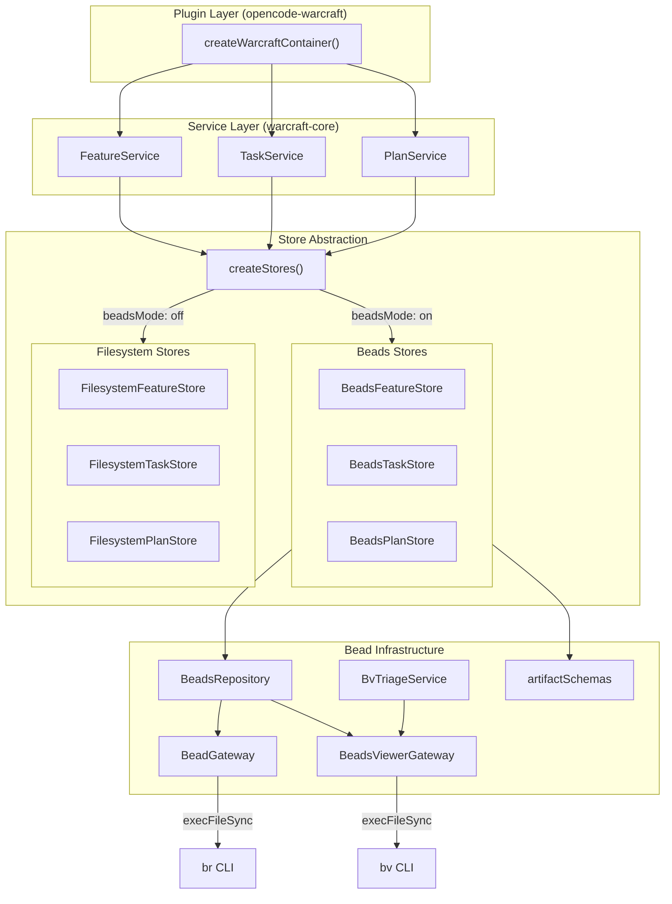
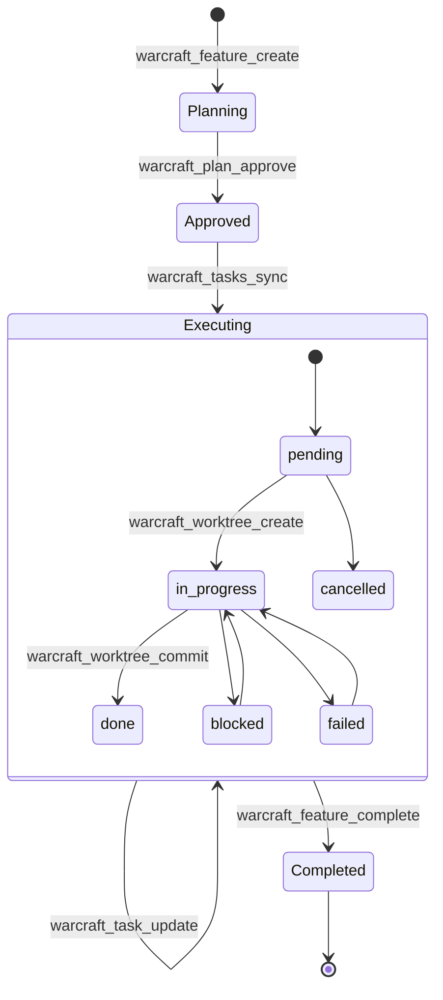

# Beads Subsystem Architecture

The **beads** subsystem provides a structured persistence and tracking layer for features, tasks, and plans. It uses the [`br` (beads_rust)](https://github.com/minhtri2710/beads_rust) CLI for bead management and optionally the `bv` (Beads Viewer) CLI for triage and robot-plan queries.

## Overview



## Beads Mode: On vs Off

The `beadsMode` setting (`'on'` | `'off'`) determines which storage backend is used.

| Aspect | **On** (default) | **Off** |
|--------|-----------------|---------|
| Storage | Bead artifacts via `br` CLI | JSON files on local filesystem |
| Feature state | `feature_state` artifact in epic bead | `.warcraft/features/<name>/feature.json` |
| Task state | `task_state` artifact in task bead | `.warcraft/features/<name>/tasks/<folder>/status.json` |
| Plan content | Bead description on epic | `.warcraft/features/<name>/plan.md` |
| Plan approval | `plan_approval` artifact | `.warcraft/features/<name>/plan-approved.json` |
| Comments | Bead comments | `.warcraft/features/<name>/plan-comments.json` |
| Sync lifecycle | Import → operate → flush | Direct filesystem reads/writes |
| `br` dependency | **Required** | Not used |

## Key Components

### BeadGateway

Low-level wrapper around the `br` CLI binary. All bead operations go through this class.

| Method | Purpose |
|--------|---------|
| `ensureInitialized()` | Initialize `.beads/beads.db` if missing |
| `createEpic()` / `createTask()` | Create epic/task beads, return bead ID |
| `syncTaskStatus()` | Map task status to bead actions (close/claim/defer) |
| `upsertArtifact()` | Write keyed artifacts into bead descriptions |
| `importArtifacts()` / `flushArtifacts()` | Sync between bead DB and filesystem |
| `show()` / `list()` | Query bead data |

### BeadsRepository

High-level CRUD repository wrapping `BeadGateway` with:
- **Error normalization** via `RepositoryError` (codes: `gateway_error`, `gateway_unavailable`, `epic_not_found`, `not_initialized`)
- **Result types** — operations return `Result<T>` with success/error discriminated unions
- **Sync policy** — configurable `autoImport`/`autoFlush` (default: flush after writes)

### BeadsViewerGateway

Manages the `bv` CLI for parallel execution planning:
- `getRobotPlan()` — returns `RobotPlanResult` with parallel execution tracks
- Health tracking (enabled, available, last error/success timestamps)

### BvTriageService

Caching triage layer on top of `BeadsViewerGateway`:
- Per-bead blocker triage with cache
- Global triage across all beads
- Health/availability tracking

### artifactSchemas

Canonical type definitions + encode/decode helpers for all artifact payloads:

| Artifact | Stored In | Key Type |
|----------|-----------|----------|
| `FeatureStateArtifact` | Epic bead | `feature_state` |
| `TaskStateArtifact` | Task bead | `task_state` |
| `PlanApprovalArtifact` | Epic bead | `plan_approval` |
| `PlanCommentsArtifact` | Epic bead | `plan_comments` |
| `ReportArtifact` | Epic bead | `report` |

All artifacts are versioned (`schemaVersion: 1`) with legacy format migration support.

## State Lifecycle



## File Layout

```
.beads/                          # Bead database (beadsMode: on)
  beads.db                       # SQLite database managed by br

.warcraft/                       # Warcraft workspace (beadsMode: off)
  features/
    <feature-name>/
      feature.json               # Feature state
      plan.md                    # Plan content
      plan-approved.json         # Plan approval record
      plan-comments.json         # Plan comments
      tasks/
        <task-folder>/
          status.json            # Task state
          spec.md                # Task specification
```

## Store Factory

`createStores()` in [`factory.ts`](src/services/state/factory.ts) selects the storage implementation:

```typescript
if (beadsMode === 'on') {
  return {
    featureStore: new BeadsFeatureStore(projectRoot, repository),
    taskStore: new BeadsTaskStore(projectRoot, repository),
    planStore: new BeadsPlanStore(projectRoot, repository),
  };
}
return {
  featureStore: new FilesystemFeatureStore(projectRoot),
  taskStore: new FilesystemTaskStore(projectRoot, repository),
  planStore: new FilesystemPlanStore(projectRoot),
};
```

All stores implement `FeatureStore`, `TaskStore`, and `PlanStore` interfaces from [`types.ts`](src/services/state/types.ts), ensuring services are storage-agnostic.
